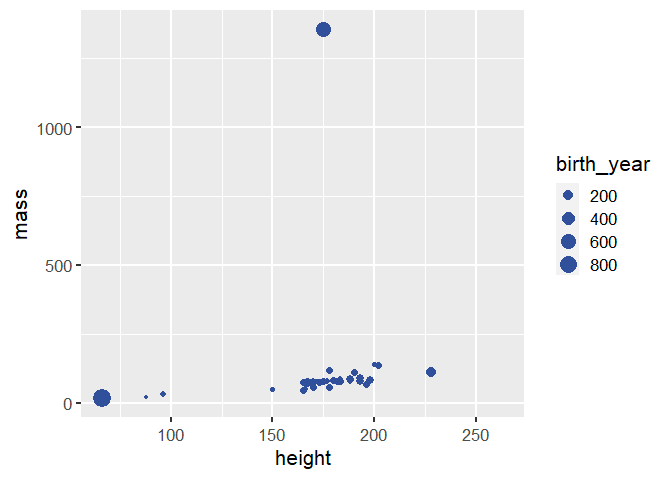

Визуализация персонажей Звездных войн
================
Mine Çetinkaya-Rundel

### Взглянем на фрейм starwars.

``` r
glimpse(starwars)
```

    ## Rows: 87
    ## Columns: 14
    ## $ name       <chr> "Luke Skywalker", "C-3PO", "R2-D2", "Darth V~
    ## $ height     <int> 172, 167, 96, 202, 150, 178, 165, 97, 183, 1~
    ## $ mass       <dbl> 77.0, 75.0, 32.0, 136.0, 49.0, 120.0, 75.0, ~
    ## $ hair_color <chr> "blond", NA, NA, "none", "brown", "brown, gr~
    ## $ skin_color <chr> "fair", "gold", "white, blue", "white", "lig~
    ## $ eye_color  <chr> "blue", "yellow", "red", "yellow", "brown", ~
    ## $ birth_year <dbl> 19.0, 112.0, 33.0, 41.9, 19.0, 52.0, 47.0, N~
    ## $ sex        <chr> "male", "none", "none", "male", "female", "m~
    ## $ gender     <chr> "masculine", "masculine", "masculine", "masc~
    ## $ homeworld  <chr> "Tatooine", "Tatooine", "Naboo", "Tatooine",~
    ## $ species    <chr> "Human", "Droid", "Droid", "Human", "Human",~
    ## $ films      <list> <"The Empire Strikes Back", "Revenge of the~
    ## $ vehicles   <list> <"Snowspeeder", "Imperial Speeder Bike">, <~
    ## $ starships  <list> <"X-wing", "Imperial shuttle">, <>, <>, "TI~

### Модифицируйте следующий график для замены цвета всех точек на розовый (`"pink"`).

``` r
ggplot(starwars, 
       aes(x = height, y = mass, color = gender, size = birth_year)) +
  geom_point(color = "#30509C")
```

    ## Warning: Removed 51 rows containing missing values (geom_point).

<!-- -->

### Добавьте заголовок и подписи к осям и легенде. Раскомментируйте строчки, чтобы увидеть результат.

``` r
ggplot(starwars, 
       aes(x = height, y = mass, color = gender, size = birth_year)) +
  geom_point(color = "#30509C") +
  labs(
    #title = "___",
    #x = "___", 
    #y = "___",
    #___
    )
```

    ## Warning: Removed 51 rows containing missing values (geom_point).

<!-- -->

### Выберите одну категориальную переменную из набора данных и постройте столбчатый график ее распределения.

(Небольшой фрагмент стартового кода представлен ниже и этот фрагмент
кода не будет исполняться (настройка `eval = FALSE`), поскольку
имеющийся код синтаксически некорректен и не может быть исполнен, что
заблокирует весь документ. Когда вы дополните этот код, замените
настройку фрагмента на `eval = TRUE` либо вообще удалите опцию `eval`).

``` r
ggplot(starwars, aes(___)) +
  geom___
```

### Выберите одну числовую переменную из набора данных и постройте гистограмму ее распределения.

(На сей раз стартового фрагмента кода нет, работайте самостоятельно!)

### Выберите числовую и категориальную переменные и создайте визуализацию (вы сами выбираете тип!) отношения между этими переменными. Помимо вашего кода и результата, изложите интерпретацию вашей визуализации.

### Выберите две категориальные переменные и создайте визуализацию отношения между этими переменными. Помимо вашего кода и результата, изложите интерпретацию вашей визуализации.

### Выберите две числовые и две категориальные переменные и создайте визуализацию, которая включает все эти переменные. Изложите интерпретацию вашей визуализации.
