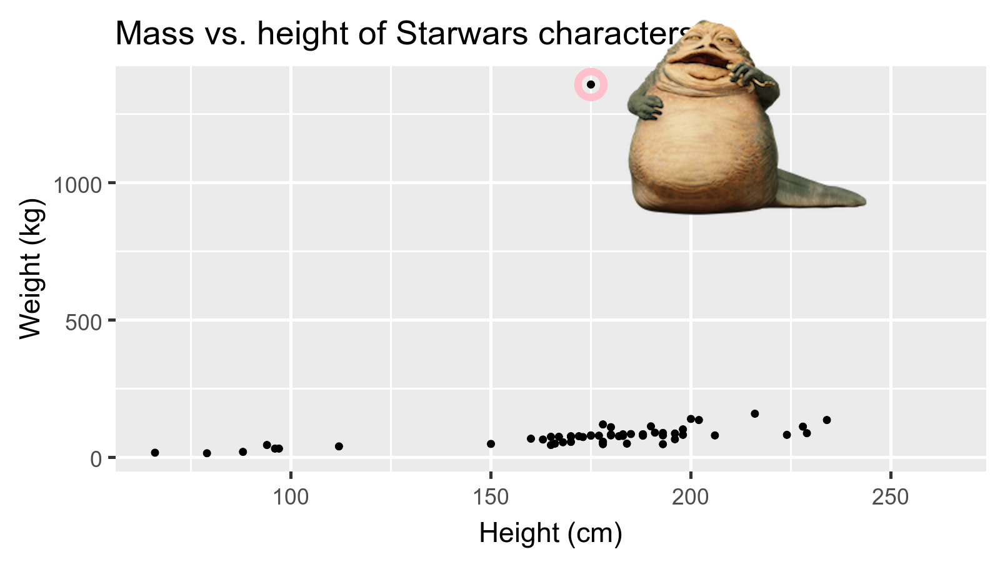

```{r child = "../setup.Rmd"}
```

```{r packages, echo=FALSE, message=FALSE, warning=FALSE}
library(tidyverse)
library(magick)
library(Tmisc)
library(dsbox)
```

class: middle

# Что содержится в наборе данных?

---

## Основы терминологии

- Каждая строка - это **наблюдение**
- Каждый столбец - это **переменная**

.small[

```{r message=FALSE}
starwars
```

]

---

## Luke Skywalker


---

## Что содержится в наборе данных Star Wars?

Взглянем на данные с помощью функции `glimpse()`:

```{r}
glimpse(starwars)
```

---

.question[
Сколько строк и столбцов содержит этот набор данных?
Что представляет каждая строка?
Что представляет каждый столбец?
]

```{r eval = FALSE}
?starwars
```

```{r echo=FALSE}
knitr::include_graphics("img/starwars-help.png")
```

---

.question[
Сколько строк и столбцов содержится в этом наборе данных?
]

.pull-left[
```{r}
nrow(starwars) # число строк
ncol(starwars) # число столбцов
dim(starwars)  # размерность (строки столбцы)
```
]

---

class: middle

# Разведочный анализ данных

---

## Что такое разведочный анализ данных?

- Разведочный анализ данных заключается в представлении основных характеристик данных
- Зачастую, это именно визуальный анализ - с этого мы и начнем
- Однако нам понадобится также рассчитать выборочные статистики и даже заняться манипулированием/трансформацией данных на этой (или даже раньше) стадии анализа - до этого мы тоже доберемся

---

## Mass vs. height

.question[ 
Как бы вы описали зависимость между массой и ростом у персонажей Звездных войн?
Какие  переменные помогут нам понять особые точки, не следующие основному тренду?
Кто это там невысокий, но реально толстый чувак?
]

```{r echo=FALSE, fig.width=8, warning=FALSE, out.width="50%"}
ggplot(data = starwars, mapping = aes(x = height, y = mass)) +
  geom_point() +
  labs(title = "Mass vs. height of Starwars characters",
       x = "Height (cm)", y = "Weight (kg)") +
  geom_point(data = starwars %>% filter(name == "Jabba Desilijic Tiure"), size = 5, pch = 1, color = "pink", stroke = 3)
```

---

## Jabba!

```{r echo = FALSE, warning = FALSE, cache = TRUE, out.width = "80%"}
jabba <- image_read("img/jabba.png")

fig <- image_graph(width = 1600, height = 900, res = 200)
ggplot(data = starwars, mapping = aes(x = height, y = mass)) +
  geom_point() +
  labs(title = "Mass vs. height of Starwars characters",
       x = "Height (cm)", y = "Weight (kg)") +
  geom_point(data = starwars %>% filter(name == "Jabba Desilijic Tiure"), size = 5, pch = 1, color = "pink", stroke = 3)
dev.off()

out <- fig %>% image_composite(jabba, offset = "+1000+30")

image_write(out, "img/jabbaplot.png", format = "png")

```

---

class: middle

# Визуализация данных

---

## Визуализация данных

> *"The simple graph has brought more information to the data analyst's mind than any other device." --- John Tukey*

- Визуализация данных - это создание и изучение визуального прелставления данных
- Есть много инструментов для визуализации данных - R один из них
- Много подходов/систем визуализации данных внутри R - **ggplot2** один из них, именно его мы будем использовать

---

## ggplot2 $\in$ tidyverse

.pull-left[
```{r echo=FALSE, out.width="80%"}
knitr::include_graphics("img/ggplot2-part-of-tidyverse.png")
```
] 
.pull-right[ 
- **ggplot2** - это пакет визуализации данных внутри tidyverse
- `gg` в "ggplot2" означает Grammar of Graphics 
- Реализует идеи книги Леланда Уилкинсона **Grammar of Graphics**
]

---

## Grammar of Graphics

.pull-left-narrow[
Грамматика графики - это инструмент, позволяющий сжато описывать компоненты графики
]
.pull-right-wide[
```{r echo=FALSE, out.width="100%"}
knitr::include_graphics("img/grammar-of-graphics.png")
```
]

.footnote[ Source: [BloggoType](http://bloggotype.blogspot.com/2016/08/holiday-notes2-grammar-of-graphics.html)]

---

## Mass vs. height

```{r mass-height, fig.width = 8, out.width = "50%"}
ggplot(data = starwars, mapping = aes(x = height, y = mass)) +
  geom_point() +
  labs(title = "Mass vs. height of Starwars characters",
       x = "Height (cm)", y = "Weight (kg)")
```

---

.question[ 
- Какие функции создают график?
- Какой набор данных визуализирутся?
- Какие переменные соответствуют каким элементам (эстетикам) графика?
- Что означает предупреждение?<sup>+</sup>
]

```{r ref.label="mass-height", fig.show = "hide"}
```

.footnote[
<sup>+</sup>В дальнейшем предупреждения не отображены в целях экономии места
]

---

## Hello ggplot2!

.pull-left-wide[
- `ggplot()` - это основная функция пакета ggplot2
- Графики создаются послойно
- Структура кода может быть представлена следующим образом

```{r eval = FALSE}
ggplot(data = [dataset], 
       mapping = aes(x = [x-variable], y = [y-variable])) +
   geom_xxx() +
   other options
```

- Пакет ggplot2 входит в tidyverse

```{r}
library(tidyverse)
```

- Справка по ggplot2, см. [ggplot2.tidyverse.org](http://ggplot2.tidyverse.org/)
]

---

class: middle

# Засчем нужна визуализация?

---

## Anscombe's quartet

```{r quartet-for-show, eval = FALSE, echo = FALSE}
library(Tmisc)
quartet
```

.pull-left[
```{r quartet-view1, echo = FALSE}
quartet[1:22,]
```
] 
.pull-right[
```{r quartet-view2, echo = FALSE}
quartet[23:44,]
```
]

---

## Описательные статистики для квартета Энскомба

```{r quartet-summary}
quartet %>%
  group_by(set) %>%
  summarise(
    mean_x = mean(x), 
    mean_y = mean(y),
    sd_x = sd(x),
    sd_y = sd(y),
    r = cor(x, y)
  )
```

---

## Визуализация квартета Энскомба

```{r quartet-plot, echo = FALSE, out.width = "80%", fig.asp = 0.5}
ggplot(quartet, aes(x = x, y = y)) +
  geom_point() +
  facet_wrap(~ set, ncol = 4)
```

